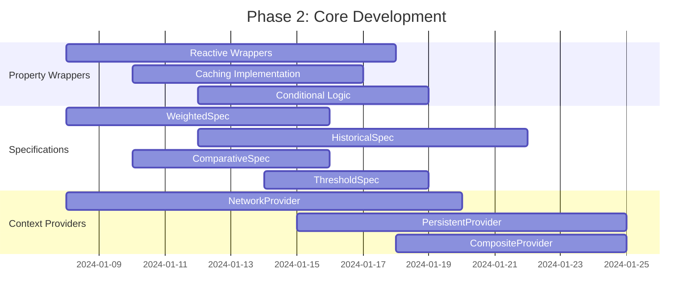
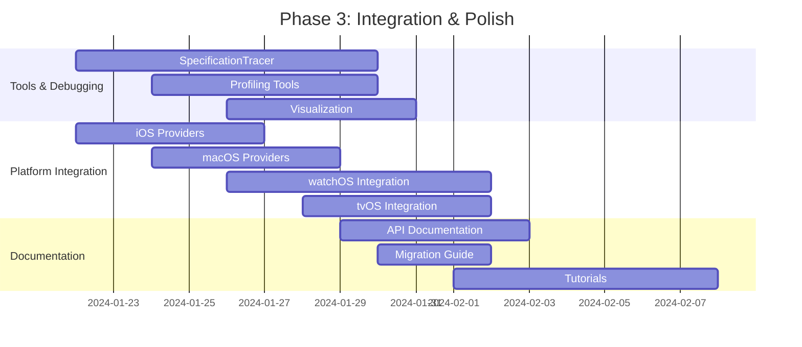

# SpecificationKit v3.0.0 AI Agent Implementation Plan

## 1. Executive Summary

### Objective
Transform the SpecificationKit v3.0.0 TODO specification into an actionable, dependency-aware implementation plan for AI agents. This document provides complete technical specifications, task breakdown, implementation guidelines, and verification criteria to enable autonomous development.

### Scope & Success Criteria
- Complete implementation of all P0-P3 tasks from the v3.0.0 specification
- Zero regressions in existing functionality
- Swift 6 compatibility with performance benchmarks showing <5% degradation
- Comprehensive test coverage for all new features
- Production-ready documentation and migration guides

### Key Deliverables
1. Enhanced property wrapper ecosystem with reactive, cached, and conditional variants
2. Advanced specification types (weighted, historical, comparative, threshold)
3. Robust context provider system (network, persistent, composite)
4. Developer tooling (tracer, profiler, visualization)
5. Platform-specific integrations (iOS, macOS, watchOS, tvOS)
6. Comprehensive testing and documentation suite

## 2. Phase-Based Implementation Strategy

### Phase 0: Foundation & Critical Path (Week 1-2)
**Status**: Blocked by toolchain dependencies
**Parallel Execution**: Limited due to macro toolchain constraints

#### Blocked Tasks (Toolchain Dependencies)
| Task | Complexity | Agent Profile | Prerequisites |
|------|------------|---------------|---------------|
| Context type validation in @AutoContext | High | Macro Specialist | Swift conformance macro support |
| @AutoContext integration tests | Medium | Test Engineer | Completion of validation task |
| Negative test cases for type mismatches | Medium | Test Engineer | Macro validation working |

**Implementation Strategy**: Mark as deferred until Swift toolchain evolution. Document expectations and create placeholder implementations.

### Phase 1: Core Enhancements (Week 2-4)
**Status**: Ready for implementation
**Parallel Execution**: High - tasks are largely independent

#### High Priority Tasks
```markdown
## P1.1: Macro System Enhancement
- **Task**: Support constructing specs via wrapper parameters
- **Agent**: Macro Development Specialist
- **Complexity**: Medium-High (3/5)
- **Dependencies**: None
- **Acceptance Criteria**:
  - `@Satisfies(using: CooldownIntervalSpec.self, interval: 10)` compiles
  - Parameter types inferred correctly
  - Comprehensive unit test coverage
- **Technical Approach**:
  - Extend wrapper attribute parsing to accept constructor parameters
  - Update macro expansion to instantiate specs with arguments
  - Implement generic constraints for parameter type inference

## P1.2: Package Management
- **Task**: Prepare for Swift Package Index submission
- **Agent**: DevOps/Package Management Specialist
- **Complexity**: Low-Medium (2/5)
- **Dependencies**: Code completion for validation
- **Acceptance Criteria**:
  - Package metadata complete and valid
  - Swift Package Index validation passes
  - Semantic versioning tag 3.0.0 applied
  - License compliance verified
```

### Phase 2: Performance & Polish (Week 3-5)
**Status**: Ready with some dependencies
**Parallel Execution**: Medium - benchmark dependencies exist

#### Critical Performance Tasks
```markdown
## P2.1: Benchmarking Infrastructure
- **Task**: Implement comprehensive performance benchmarks
- **Agent**: Performance Engineering Specialist
- **Complexity**: Medium (3/5)
- **Dependencies**: None (can start immediately)
- **Technical Specifications**:
  - XCTest Performance integration
  - Baseline comparison with v2.0.0
  - Macro compilation timing analysis
  - Memory usage profiling
- **Success Metrics**:
  - <5% regression in specification evaluation
  - <10% overhead in macro compilation
  - Memory usage within 10% of baseline

## P2.2: AnySpecification Optimization
- **Task**: Profile and optimize core abstraction bottlenecks
- **Agent**: Performance Engineering Specialist
- **Complexity**: Medium-High (3/5)
- **Dependencies**: Benchmark infrastructure
- **Implementation Approach**:
  - Instruments profiling for hotspot identification
  - @inlinable annotation evaluation
  - Specialized implementation consideration
  - Before/after performance comparison
```

### Phase 3: Feature Development (Week 4-8)
**Status**: Ready for parallel development
**Parallel Execution**: High - feature groups are independent

#### Feature Development Matrix

| Feature Group | Lead Agent | Complexity | Duration | Dependencies |
|---------------|------------|------------|----------|--------------|
| Property Wrapper Ecosystem | SwiftUI/Reactive Specialist | High | 2 weeks | None |
| Advanced Specification Types | Algorithm/Logic Specialist | High | 2 weeks | Context providers |
| Context Provider Enhancement | Backend/Persistence Specialist | High | 2-3 weeks | None |
| Testing & Debugging Tools | Test Infrastructure Specialist | Medium | 1-2 weeks | Core features |
| Platform-Specific Features | Platform Integration Specialist | Medium | 1-2 weeks | Context providers |
| Integration & Interoperability | System Integration Specialist | High | 2-3 weeks | Multiple dependencies |

## 3. Detailed Task Specifications

### 3.1 Enhanced Property Wrapper Ecosystem

#### Task 3.1.1: Reactive Wrapper Implementation
```swift
// Implementation Target
@propertyWrapper
public struct ObservedDecides<Context, Result>: DynamicProperty {
    @StateObject private var publisher: DecisionPublisher<Context, Result>
    
    public var wrappedValue: Result { /* implementation */ }
    public var projectedValue: Published<Result>.Publisher { /* implementation */ }
}

// Acceptance Test Template
func testObservedDecidesReactivity() {
    // Given: A specification that changes based on context
    // When: Context updates occur
    // Then: SwiftUI view updates are triggered
}
```

**Agent Requirements**:
- **Primary Skills**: SwiftUI, Combine, Property Wrappers
- **Secondary Skills**: Performance optimization, thread safety
- **Deliverables**:
  - @ObservedDecides implementation
  - @ObservedMaybe implementation  
  - @CachedSatisfies with TTL support
  - @ConditionalSatisfies with runtime selection
  - Comprehensive unit tests (>90% coverage)
  - SwiftUI integration examples

#### Task 3.1.2: Caching Implementation
**Technical Specifications**:
- Thread-safe cache with configurable TTL
- Memory pressure handling
- Manual invalidation API
- Performance benchmarks vs uncached

### 3.2 Advanced Specification Types

#### Task 3.2.1: WeightedSpec Implementation
```swift
// API Design Target
public struct WeightedSpec<Context, Result>: Specification {
    public typealias Candidate = (specification: any Specification<Context>, weight: Double, result: Result)
    
    public let candidates: [Candidate]
    
    public func isSatisfiedBy(_ context: Context) -> Result {
        // Weighted random selection based on probability distribution
    }
}
```

**Agent Requirements**:
- **Primary Skills**: Probability algorithms, Swift generics
- **Implementation Focus**:
  - Mathematically sound weight distribution
  - Edge case handling (zero weights, empty candidates)
  - Performance optimization for large candidate sets
  - Comprehensive statistical testing

#### Task 3.2.2: HistoricalSpec Implementation
**Technical Approach**:
- Time-series data integration with context providers
- Sliding window analysis capabilities
- Missing data interpolation strategies
- Performance optimization for large datasets

### 3.3 Context Provider Enhancements

#### Task 3.3.1: NetworkContextProvider
```swift
// Implementation Target
public final class NetworkContextProvider: ContextProviding {
    public struct Configuration {
        let endpoint: URL
        let refreshInterval: TimeInterval
        let cachePolicy: CachePolicy
        let fallbackValues: [String: Any]
    }
    
    public func getValue(for key: String) async throws -> Any? {
        // Network fetch with caching and fallback logic
    }
}
```

**Agent Requirements**:
- **Primary Skills**: URLSession, async/await, caching
- **Technical Challenges**:
  - Network error handling and recovery
  - Offline mode with fallback values
  - Thread-safe caching implementation
  - Request deduplication and batching

#### Task 3.3.2: PersistentContextProvider
**Implementation Approach**:
- Core Data integration with schema migration
- Thread-safe read/write operations
- Combine publisher integration for change notifications
- SQLite fallback for lightweight scenarios

### 3.4 Testing & Debugging Infrastructure

#### Task 3.4.1: SpecificationTracer
```swift
// API Design Target
public final class SpecificationTracer {
    public struct TraceEntry {
        let specification: String
        let context: String
        let result: String
        let executionTime: TimeInterval
        let depth: Int
    }
    
    public func trace<T>(_ specification: any Specification, context: T) -> [TraceEntry] {
        // Record evaluation path through specification tree
    }
}
```

**Agent Requirements**:
- **Primary Skills**: Debugging tools, reflection, performance measurement
- **Implementation Focus**:
  - Zero-overhead when disabled
  - Integration with system logging
  - Visual representation capabilities
  - Thread-safe trace collection

## 4. Implementation Guidelines

### 4.1 Code Quality Standards

#### Swift 6 Compliance
```swift
// Required: Explicit concurrency annotations
public actor NetworkContextProvider: ContextProviding {
    private var cache: [String: CachedValue] = [:]
    
    public func getValue(for key: String) async -> Any? {
        // Thread-safe implementation
    }
}

// Required: Sendable conformance
public struct SpecificationResult: Sendable {
    public let value: Any
    public let timestamp: Date
}
```

#### Performance Requirements
- **Specification Evaluation**: <1ms for simple specs, <10ms for complex
- **Macro Compilation**: <10% overhead vs manual implementation
- **Memory Usage**: <10% increase vs v2.0.0 baseline
- **Thread Safety**: All public APIs must be concurrency-safe

#### Testing Requirements
- **Unit Test Coverage**: >90% for all new features
- **Integration Tests**: Complete end-to-end scenarios
- **Performance Tests**: Regression detection for critical paths
- **Platform Tests**: Verification on iOS, macOS, watchOS, tvOS

### 4.2 Documentation Standards

#### API Documentation
- **DocC Integration**: All public symbols documented
- **Code Examples**: Runnable examples for complex features
- **Migration Guides**: Step-by-step v2.x → v3.0.0 instructions
- **Best Practices**: Performance and security guidelines

#### Tutorial Requirements
- **Interactive Playgrounds**: Xcode-compatible exploration environments
- **Sample Applications**: Real-world usage demonstrations
- **Video Tutorials**: Complex feature explanations (optional)

### 4.3 Dependency Management

#### External Dependencies
- **Principle**: Minimize external dependencies
- **Approved**: Foundation, SwiftUI, Combine, Core Data, CloudKit
- **Prohibited**: Third-party networking, persistence, or UI libraries
- **Platform-Specific**: Conditional compilation with #if directives

#### Internal Architecture
```swift
// Module Structure Target
SpecificationKit/
├── Core/                    // Foundation protocols and types
├── Specifications/          // Built-in specification implementations
├── Wrappers/               // Property wrapper implementations
├── Providers/              // Context provider implementations
├── Tools/                  // Testing and debugging utilities
├── Platforms/              // Platform-specific integrations
└── Integrations/           // SwiftData, Combine, Core Data bridges
```

## 5. Task Execution Matrix

### 5.1 Parallel Execution Strategy

#### Week 1-2: Foundation Phase
```mermaid
gantt
    title Phase 1: Foundation & Setup
    dateFormat  YYYY-MM-DD
    section Critical Path
    Benchmark Infrastructure    :crit, bench, 2024-01-01, 5d
    Macro Parameter Support     :crit, macro, 2024-01-03, 7d
    Package Metadata           :pack, 2024-01-01, 3d
    
    section Blocked Tasks
    @AutoContext Validation    :blocked, auto, 2024-01-01, 14d
```

#### Week 3-5: Core Development Phase


#### Week 6-8: Integration & Polish Phase


### 5.2 Agent Role Assignments

#### Specialized Agent Profiles

**1. Macro Development Specialist**
- **Primary Focus**: @AutoContext enhancements, parameter support
- **Skills**: Swift macros, compiler plugins, generic programming
- **Deliverables**: Enhanced wrapper syntax, macro diagnostics

**2. Performance Engineering Specialist**
- **Primary Focus**: Benchmarking, optimization, profiling
- **Skills**: Instruments, XCTest Performance, memory profiling
- **Deliverables**: Performance baselines, optimization recommendations

**3. SwiftUI/Reactive Specialist**
- **Primary Focus**: Property wrapper ecosystem, reactive patterns
- **Skills**: SwiftUI, Combine, property wrappers, state management
- **Deliverables**: @ObservedDecides, @ObservedMaybe, reactive integrations

**4. Algorithm/Logic Specialist**
- **Primary Focus**: Advanced specification types
- **Skills**: Probability algorithms, statistical analysis, generics
- **Deliverables**: WeightedSpec, HistoricalSpec, mathematical correctness

**5. Backend/Persistence Specialist**
- **Primary Focus**: Context provider infrastructure
- **Skills**: Network programming, Core Data, caching, concurrency
- **Deliverables**: NetworkContextProvider, PersistentContextProvider

**6. Test Infrastructure Specialist**
- **Primary Focus**: Testing tools, debugging utilities
- **Skills**: Test frameworks, debugging tools, developer experience
- **Deliverables**: SpecificationTracer, MockSpecificationBuilder

**7. Platform Integration Specialist**
- **Primary Focus**: Platform-specific features and context providers
- **Skills**: iOS/macOS/watchOS/tvOS APIs, privacy compliance
- **Deliverables**: Platform context providers, integration examples

**8. System Integration Specialist**
- **Primary Focus**: SwiftData, Combine, Core Data, CloudKit integrations
- **Skills**: Apple ecosystem integration, data synchronization
- **Deliverables**: Framework bridges, synchronization logic

**9. Documentation Specialist**
- **Primary Focus**: Comprehensive documentation and examples
- **Skills**: Technical writing, DocC, tutorial creation
- **Deliverables**: API docs, migration guides, sample applications

**10. DevOps/Package Management Specialist**
- **Primary Focus**: Package distribution, CI/CD, release management
- **Skills**: Swift Package Manager, version management, automation
- **Deliverables**: Package metadata, Swift Package Index submission

### 5.3 Critical Success Factors

#### Quality Gates
1. **Code Review**: All implementations require peer review
2. **Performance Testing**: Benchmark validation for each major feature
3. **Integration Testing**: Cross-platform compatibility verification
4. **Documentation Review**: Technical accuracy and completeness validation

#### Risk Mitigation
1. **Toolchain Dependencies**: Blocked tasks tracked with alternative approaches
2. **Performance Regression**: Continuous benchmarking with rollback criteria
3. **API Breaking Changes**: Comprehensive migration testing
4. **Platform Compatibility**: Automated testing on all supported platforms

#### Success Metrics
- **Feature Completion**: 100% of P1-P2 tasks, 80% of P3 tasks
- **Performance**: <5% regression in core evaluation paths
- **Test Coverage**: >90% for new features, >95% for critical paths
- **Documentation**: 100% API coverage, complete migration guide

## 6. Implementation Verification

### 6.1 Automated Testing Strategy

#### Unit Testing Requirements
```swift
// Test Template Example
class WeightedSpecTests: XCTestCase {
    func testProbabilityDistribution() {
        // Given: WeightedSpec with known distribution
        let spec = WeightedSpec(candidates: [
            (AlwaysTrueSpec(), weight: 0.7, result: "A"),
            (AlwaysTrueSpec(), weight: 0.3, result: "B")
        ])
        
        // When: Multiple evaluations performed
        let results = (1...10000).map { _ in spec.isSatisfiedBy(EmptyContext()) }
        
        // Then: Distribution matches expected weights within tolerance
        let aCount = results.filter { $0 == "A" }.count
        let ratio = Double(aCount) / Double(results.count)
        XCTAssertEqual(ratio, 0.7, accuracy: 0.05)
    }
}
```

#### Integration Testing Framework
```swift
// Integration Test Example
class SpecificationKitIntegrationTests: XCTestCase {
    func testNetworkProviderWithCachedWrapper() async {
        // Given: NetworkContextProvider with caching
        let provider = NetworkContextProvider(configuration: .test)
        let wrapper = CachedSatisfies(using: FeatureFlagSpec.self, provider: provider)
        
        // When: Multiple evaluations occur
        let result1 = await wrapper.evaluateAsync()
        let result2 = await wrapper.evaluateAsync() // Should use cache
        
        // Then: Results are consistent and cache is utilized
        XCTAssertEqual(result1, result2)
        XCTAssertEqual(provider.requestCount, 1) // Only one network request
    }
}
```

### 6.2 Performance Validation

#### Benchmark Framework
```swift
class SpecificationKitBenchmarks: XCTestCase {
    func testSpecificationEvaluationPerformance() {
        let spec = ComplexCompositeSpec()
        let context = TestContext()
        
        measure {
            for _ in 1...1000 {
                _ = spec.isSatisfiedBy(context)
            }
        }
        // Target: <1ms per evaluation for simple specs
    }
    
    func testMacroCompilationOverhead() {
        // Measure compilation time difference between:
        // 1. Manual specification implementation
        // 2. Macro-generated equivalent
        // Target: <10% overhead
    }
}
```

### 6.3 Documentation Verification

#### Documentation Testing
```swift
// Documentation Test Example
class DocumentationTests: XCTestCase {
    func testREADMEExamplesCompile() {
        // Extract code examples from README.md
        // Compile and verify they work as advertised
    }
    
    func testTutorialAccuracy() {
        // Verify all tutorial code examples compile and run
        // Ensure output matches documented expectations
    }
}
```

## 7. Release Preparation

### 7.1 Pre-Release Checklist

#### Code Quality
- [ ] All high-priority tasks completed
- [ ] Performance benchmarks within acceptable ranges
- [ ] Zero compiler warnings on Swift 6
- [ ] Thread safety audit completed
- [ ] Memory leak testing passed

#### Documentation
- [ ] API documentation 100% complete
- [ ] Migration guide comprehensive
- [ ] Tutorial examples verified
- [ ] Sample applications functional
- [ ] README updated with v3.0.0 features

#### Testing
- [ ] Unit test coverage >90%
- [ ] Integration tests passing
- [ ] Platform compatibility verified
- [ ] Performance regression testing completed
- [ ] Negative test cases comprehensive

#### Distribution
- [ ] Package metadata complete
- [ ] License compliance verified
- [ ] Swift Package Index validation passed
- [ ] Semantic version tag 3.0.0 ready
- [ ] Release notes prepared

### 7.2 Post-Release Support

#### Monitoring
- Community feedback collection via GitHub issues
- Performance monitoring in real-world applications
- Documentation gap identification and resolution
- Platform compatibility issue tracking

#### Maintenance
- Patch release planning for critical issues
- Future feature roadmap based on usage patterns
- Long-term deprecation timeline for v2.x APIs
- Community contribution guidelines

## 8. Success Measurement

### 8.1 Quantitative Metrics

#### Performance Metrics
- Specification evaluation latency: <1ms target
- Macro compilation overhead: <10% target
- Memory usage increase: <10% vs v2.0.0
- Test suite execution time: <5 minutes

#### Quality Metrics
- Unit test coverage: >90%
- Integration test coverage: >80%
- Documentation coverage: 100% of public APIs
- Zero critical security vulnerabilities

#### Adoption Metrics
- Swift Package Index ranking improvement
- GitHub star count increase
- Community contribution rate
- Issue resolution time <48 hours

### 8.2 Qualitative Success Factors

#### Developer Experience
- Intuitive API design following Swift conventions
- Comprehensive error messages and diagnostics
- Rich debugging and profiling capabilities
- Seamless integration with existing codebases

#### Community Impact
- Positive feedback from early adopters
- Successful migration stories from v2.x
- Third-party integrations and extensions
- Educational content creation by community

## 9. Conclusion

This implementation plan transforms the SpecificationKit v3.0.0 specification into a concrete, actionable roadmap for AI agents. With clearly defined phases, specialized agent roles, comprehensive testing strategies, and detailed success criteria, this plan enables systematic development of a major Swift library release.

The modular approach allows for parallel development while maintaining quality standards and performance requirements. The emphasis on documentation, testing, and community support ensures long-term success and adoption.

Key success factors include:
- Rigorous performance benchmarking to prevent regressions
- Comprehensive testing strategy covering edge cases and integration scenarios
- Platform-specific implementations that respect system constraints
- Clear migration path from v2.x with automated tooling where possible
- Rich developer experience with debugging and profiling tools

By following this plan, AI agents can deliver a production-ready SpecificationKit v3.0.0 that advances the state of the art in Swift specification pattern implementation while maintaining the library's core principles of type safety, performance, and developer productivity.